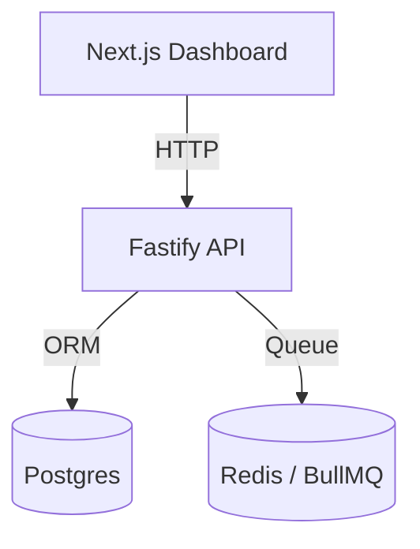

# Module: API (Product Management)

## 1. Responsibility
Provides a secure RESTful interface for the dashboard to manage scraped products, trigger posting actions, and monitor system health.

## 2. Core Features
- **Product Inventory:** CRUD operations for scraped items.
- **Job Orchestration:** Interfaces with BullMQ to queue posting tasks.
- **Config Management:** Dynamic updates to scraping intervals and pricing logic.
- **System Health:** Monitoring endpoints for database and redis status.

## 3. Architecture Diagram

## 4. Dependencies
- **Fastify:** High-performance web framework.
- **Prisma:** Database abstraction and type-safe queries.
- **BullMQ:** Message queue management.
- **Zod:** Request validation and response serialization.
