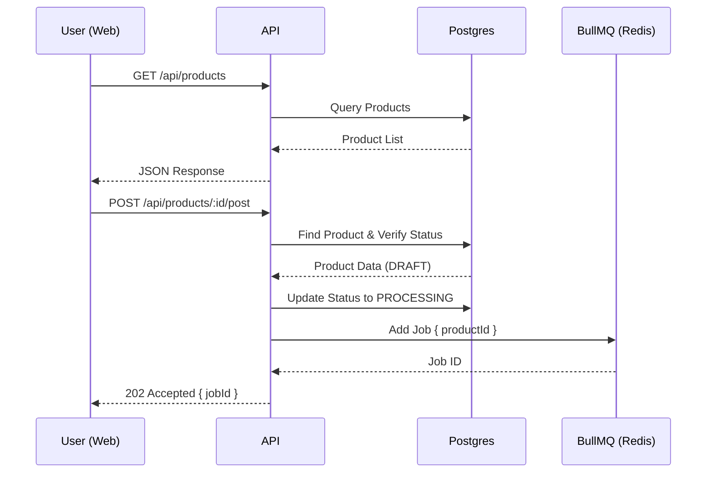

# Feature: Product Management

## 1. User Stories
- **US-08:** As a seller, I want to view all scraped products in a dashboard so that I can see what is available to post.
- **US-09:** As a seller, I want to trigger a post action for a specific product so that the automation starts listing it on Facebook.

## 2. Business Flow

## 3. Business Rules
| Rule ID | Name | Condition | Action |
|---------|------|-----------|--------|
| BR-04 | Eligible for Post | Product status is 'DRAFT' or 'FAILED' | Allow POST /post endpoint. |
| BR-05 | Ineligible for Post | Product status is 'PROCESSING' or 'POSTED' | Return 409 Conflict. |
| BR-06 | Pagination | GET /products called | Default to limit=20, page=1. |

## 4. Data Model (API Context)
- **Primary Table:** `Product`
- **Secondary Table:** `Job` (read-only for listing history).

## 5. Implementation Tasks (Backend)
- [ ] Create Fastify routes for product listing and detail.
- [ ] Implement query filters (status, search).
- [ ] Setup BullMQ producer instance.
- [ ] Implement `/post` logic with status validation and queue push.
- [ ] Configure global error handler for predictable response formats.
