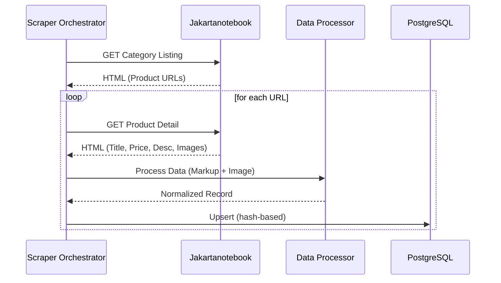

# Feature: Jakartanotebook Sourcing

## 1. User Stories
- **US-01:** As a system, I want to fetch the product listing page from Jakartanotebook so that I can discover new items.
- **US-02:** As a system, I want to scrape the detail page of each discovered URL to capture full product data.
- **US-03:** As a system, I want to apply a 25% markup to the raw price so that the final price reflects my profit margin.

## 2. Business Flow

## 3. Business Rules
| Rule ID | Name | Condition | Action |
|---------|------|-----------|--------|
| BR-01 | Price Markup | Raw price scraped | Apply `raw * 1.25` and round to nearest 1000. |
| BR-02 | Deduplication | Hash exists in DB | Skip insertion if status is not 'DRAFT' or 'FAILED'. |
| BR-03 | Image Format | Image downloaded | Resize to 1000x1000px with white padding. |

## 4. Data Model (Scraper Context)
- **Table:** `Product`
- **Fields:** `title`, `price`, `description`, `imageUrl`, `hash`, `sourceUrl`.

## 5. Implementation Tasks (Backend)
- [ ] Setup Playwright with stealth-mode configuration.
- [ ] Implement category listing parser using Cheerio/Playwright selectors.
- [ ] Implement detail page parser for rich content extraction.
- [ ] Implement image processing pipeline (download -> resize -> watermark).
- [ ] Integrate with Prisma for database upserts.
