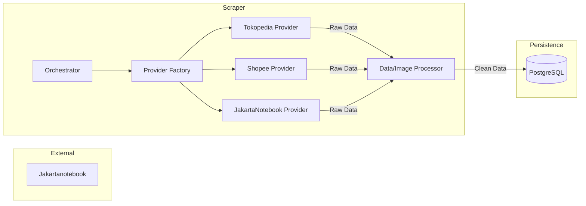

# Module: Scraper (Multi-Marketplace)

## 1. Responsibility
Automated extraction of product data from multiple marketplaces (JakartaNotebook, Tokopedia, Shopee) and ingestion into the system's database using a modular provider architecture.

## 2. Core Features
- **Multi-Provider Architecture:** Modular system to handle different marketplace DOM structures.
- **Listing Scraping:** Crawls category/search pages to discover product URLs.
- **Detail Scraping:** Extracts rich product attributes (title, price, description, images).
- **Anti-Bot Mitigation:** Stealth browser patterns and proxy rotation.
- **Image Processing:** Downloads and localizes images for FB posting.
- **Deduplication:** Prevents redundant entries using Title+Price hashing.

## 3. Architecture Diagram

## 4. Dependencies
- **Playwright:** Browser automation for dynamic content.
- **Sharp:** High-performance image processing.
- **Prisma:** Shared database client.
- **APScheduler:** Cycle management.
