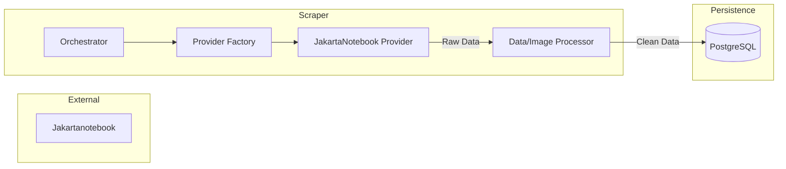

# Module: Scraper Service

## 1. Responsibility

Automated extraction of product data from Indonesian marketplaces and ingestion into the system's database using a modular provider architecture.

## 2. Scope (V1 - Release)

**Primary Source: Jakartanotebook only**

- Product focus: Accessories, gadgets, electronics
- Difficulty: Easy
- Auth required: No
- Implementation status: In progress

## 3. Core Features

- **Provider Architecture:** Modular scraper system (extensible for future sources).
- **Listing Scraping:** Crawls category/search pages to discover product URLs.
- **Detail Scraping:** Extracts rich product attributes (title, price, description, images).
- **Anti-Bot Mitigation:** Stealth browser patterns.
- **Image Processing:** Downloads and localizes images for FB posting.
- **Deduplication:** Prevents redundant entries using Title+Price hashing.

## 3. Architecture (V1)

## 4. Future Extensions (Post-V1)

- **Shopee Provider** - Requires: authenticated session + residential proxy
- **Tokopedia Provider** - Requires: Cloudflare bypass + proxy
- **Lazada Provider** - Requires: CAPTCHA handling

## 4. Dependencies

- **Playwright:** Browser automation for dynamic content.
- **Sharp:** High-performance image processing.
- **Prisma:** Shared database client.
- **APScheduler:** Cycle management.
