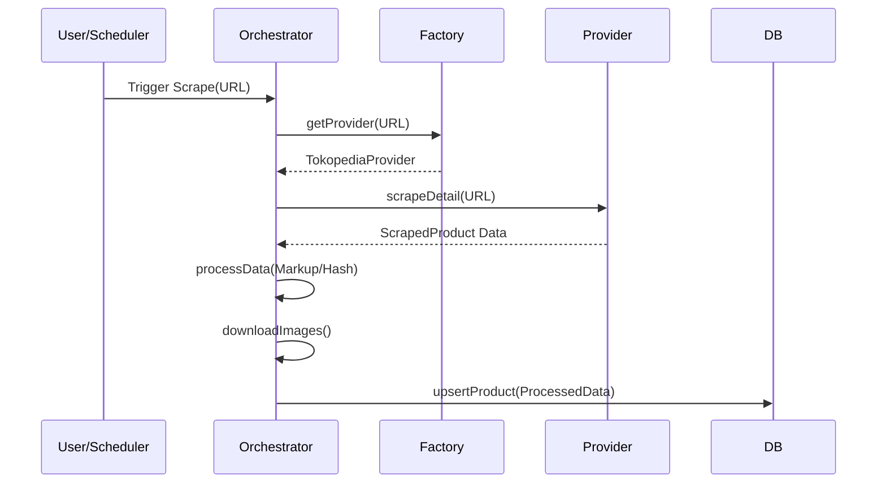

# Technical Blueprint: Multi-Source Scraper (TS)

## 1. System Architecture

The scraper is designed as a modular, provider-based service within the TypeScript monorepo. It replaces the legacy Python service.

### Components

1. **Orchestrator**: Manages the scraping lifecycle, scheduling, and job distribution.
2. **Provider Factory**: Instantiates the correct `MarketplaceProvider` based on the input URL domain.
3. **Marketplace Providers**: Specific implementations for Tokopedia, Shopee, and JakartaNotebook.
4. **Data Processor**: Synchronizes data schemas, applies price markup, and generates deduplication hashes.
5. **Image Localizer**: Download and storage of images to keep them local for FB Marketplace posting.

## 2. Interface Definition

All providers must implement the `IMarketplaceProvider` interface:

```typescript
interface IMarketplaceProvider {
  /**
   * Scrape a listing or search page to find product URLs.
   */
  scrapeListing(url: string): Promise<string[]>;

  /**
   * Scrape a single product detail page.
   */
  scrapeDetail(url: string): Promise<ScrapedProduct>;
}

type ScrapedProduct = {
  title: string;
  price: number;
  description: string;
  imageUrls: string[];
  inStock: boolean;
  sourceUrl: string;
};
```

## 3. Data Flow



## 4. Key Implementation Details

### Deduplication
- **Algorithm**: SHA256
- **Input**: `"${normalized_title}-${marked_up_price}"`
- **Purpose**: Prevents duplicate listings on FB Marketplace even if suppliers change small parts of the description.

### Anti-Bot Measures
- **Stealth**: `playwright-stealth` library.
- **Proxies**: Rotating residential proxy integration via `page.proxy`.
- **Randomization**: Jittered delays (2-7s) between actions and random User-Agent rotation.

### Tech Stack
- **Runtime**: Node.js (TypeScript)
- **Browser**: Playwright (Chromium)
- **Database**: Prisma (PostgreSQL)
- **Queue**: BullMQ (Redis)
