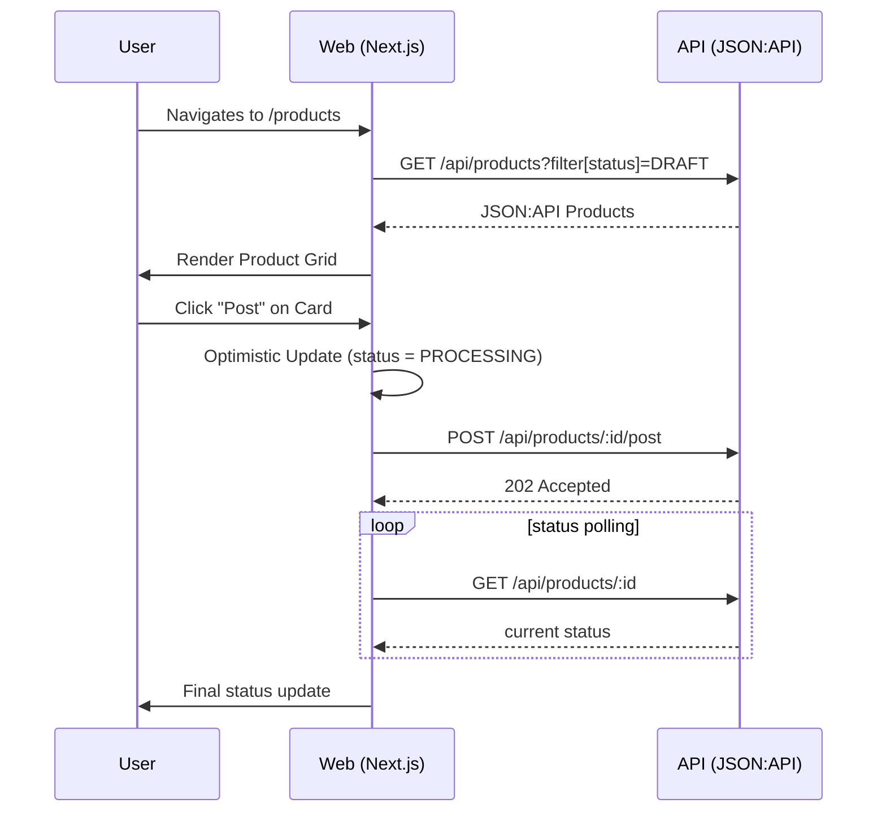

# Feature: Management Dashboard

## 1. User Stories
- **US-08:** As a seller, I want to see product cards with images and formatted prices so that I can easily identify items to post.
- **US-10:** As a seller, I want to see job logs in a drawer so that I can understand why a post failed.

## 2. Business Flow

## 3. Business Rules
| Rule ID | Name | Condition | Action |
|---------|------|-----------|--------|
| BR-10 | Status Colors | Card rendering | DRAFT: Gray, PROCESSING: Yellow (Pulse), POSTED: Green, FAILED: Red. |
| BR-11 | Action Lock | status is PROCESSING | Disable "Post" button to prevent duplicate jobs. |
| BR-12 | Currency Format | Rendering price | Format as `Rp 1.250.000` using Indonesian locale. |

## 4. Implementation Tasks (Frontend)
- [ ] Initialize Next.js 14 project with Tailwind CSS.
- [ ] Create Axios instance with JSON:API headers and interceptors.
- [ ] Build reusable UI atoms (Button, Badge, Skeleton).
- [ ] Implement `useProducts` hook with React Query for paginated listing.
- [ ] Implement `usePostProduct` mutation with optimistic UI logic.
- [ ] Build the Settings page with debounced auto-save for configuration.
