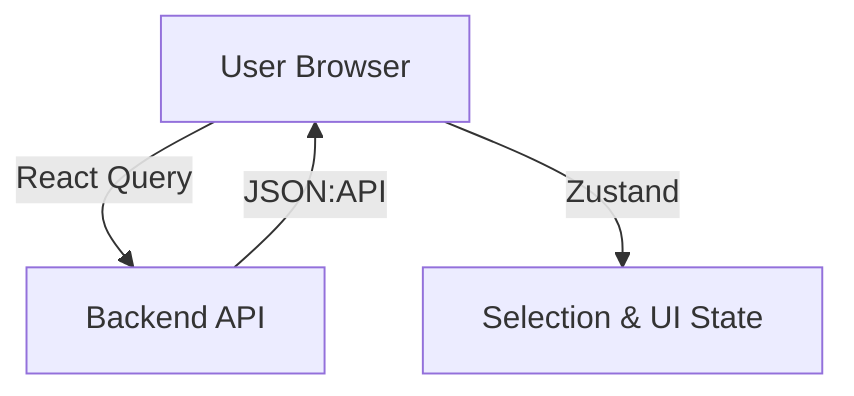

# Module: Web Dashboard (Management UI)

## 1. Responsibility
A responsive web interface for users to monitor scraped products, control posting activities, manage configurations, and view system health.

## 2. Core Features
- **Product Explorer:** Paginated list view with status tabs and search functionality.
- **Optimistic Controls:** Real-time feedback when triggering "Post" actions.
- **Detailed Tracking:** Slide-out drawer for viewing individual product details and attempt logs.
- **System Settings:** Configurable pricing markups, scraping intervals, and posting limits.

## 3. Architecture Diagram

## 4. Dependencies
- **Next.js 14:** React framework with App Router.
- **Tailwind CSS:** For consistent and rapid styling.
- **TanStack React Query:** Data fetching, caching, and polling.
- **Zustand:** Lightweight state management.
- **Lucide React:** Icon library.
