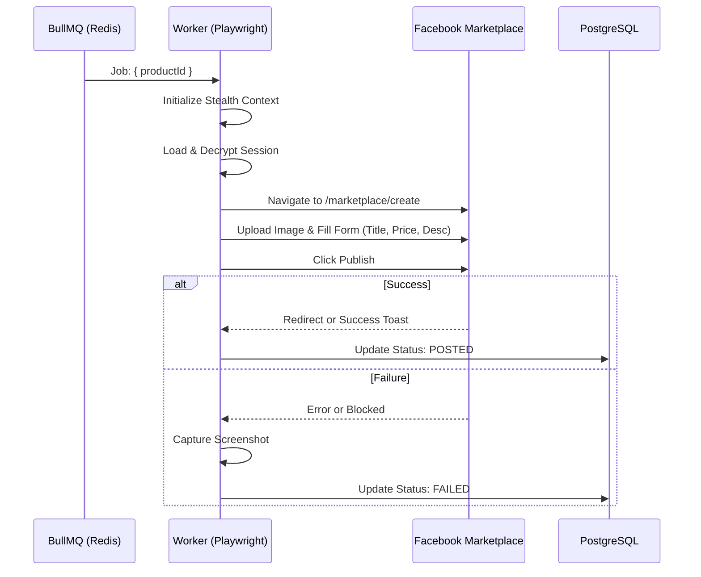

# Feature: Facebook Marketplace Posting

## 1. User Stories
- **US-11:** As a system, I want to process posting jobs from a queue so that the user dashboard remains responsive.
- **US-12:** As a system, I want to simulate human-like behavior (typing, scrolling) during the listing process so that the Facebook account is protected from bot detection.

## 2. Business Flow

## 3. Business Rules
| Rule ID | Name | Condition | Action |
|---------|------|-----------|--------|
| BR-07 | Rate Limiting | Daily limit reached | Reschedule job to next day at 08:00 AM. |
| BR-08 | Human Simulation | Entering text | Delay 50-150ms per character; 100-300ms between words. |
| BR-09 | Error Retries | Job fails | Retry up to 3 times with exponential backoff (30s, 60s, 120s). |

## 4. Data Model (Worker Context)
- **Primary Table:** `Product` (update `status`, `postedAt`).
- **Secondary Table:** `Job` (append `log`, `attempt`, `status`).

## 5. Implementation Tasks (Backend)
- [ ] Implement `FBAuth` for AES-256 session encryption/decryption.
- [ ] Develop `StealthManager` to override browser fingerprints.
- [ ] Create `MarketplacePoster` with robust selectors for FB's dynamic UI.
- [ ] Configure BullMQ worker with concurrency limit of 1 (to simulate single human behavior).
- [ ] Implement screenshot capture utility for diagnostic logging.
