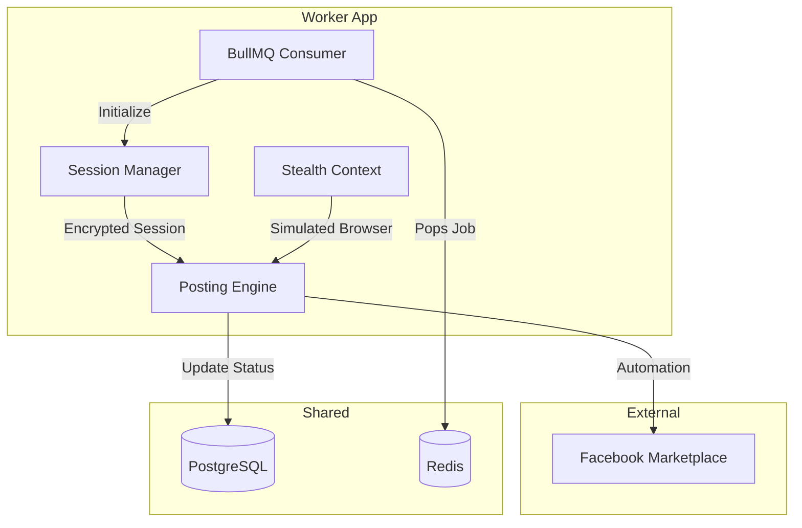

# Module: Posting Worker (Facebook Automation)

## 1. Responsibility
Consumes jobs from BullMQ and executes browser automation to list products on Facebook Marketplace while simulating human behavior to avoid detection.

## 2. Core Features
- **Session Management:** Persists Facebook login states using AES-256 encrypted session files.
- **Human Simulation:** Implements variable typing speeds, randomized mouse movements, and natural scrolling.
- **Marketplace Automation:** Navigates the FB Marketplace listing form, uploads processed images, and populates product details.
- **Success Verification:** Confirms successful publication and captures diagnostic screenshots on failure.

## 3. Architecture Diagram

## 4. Dependencies
- **Playwright:** Core browser automation engine.
- **BullMQ:** Message queue consumer.
- **Crypto (Node.js):** For AES-256 session encryption.
- **Prisma:** Database updates.
