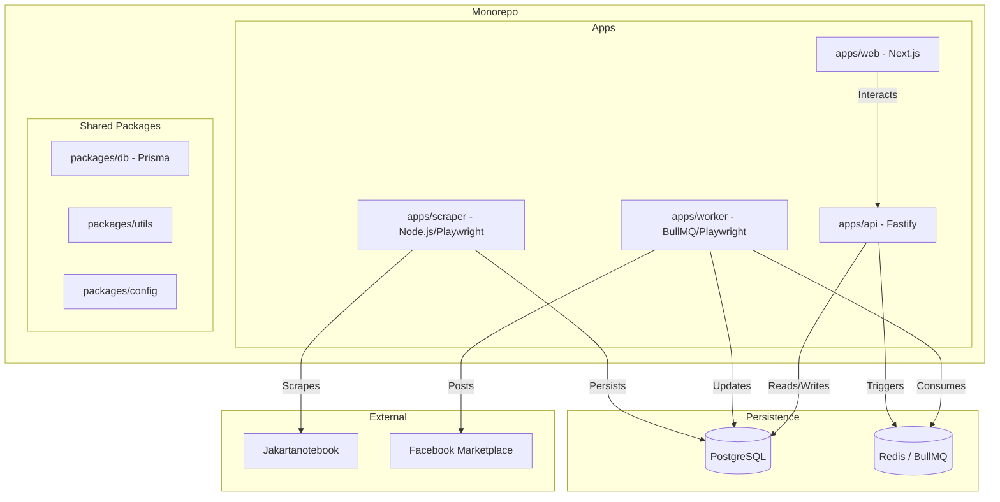

# System Architecture: FB Marketplace Auto Listing Bot

## 1. High-Level Diagram

## 2. Component Breakdown
### apps/scraper
- **Runtime:** Node.js (TypeScript).
- **Core Libs:** Playwright, Cheerio.
- **Responsibility:** Navigates Jakartanotebook, parses product data, downloads and processes images, and upserts to PostgreSQL using the shared DB package.

### apps/api
- **Runtime:** Node.js (TypeScript).
- **Framework:** Fastify.
- **Responsibility:** Provides REST endpoints for the dashboard to manage products, view logs, and change configuration. Triggers posting by adding jobs to BullMQ.

### apps/worker
- **Runtime:** Node.js (TypeScript).
- **Core Libs:** BullMQ, Playwright.
- **Responsibility:** Handles long-running browser automation tasks. Simulates human interactions to post items to FB Marketplace.

### apps/web
- **Runtime:** Node.js (TypeScript).
- **Framework:** Next.js 14.
- **Responsibility:** User dashboard for monitoring scraper results, controlling posting flow, and system configuration.

## 3. Data Flow Detail
### Scraping Cycle
1. Scraper wakes up (cron).
2. Fetch listing page -> Extract URLs.
3. Fetch detail page -> Extract full data.
4. Process images (resize, watermark).
5. Generate hash (title + price).
6. Upsert to Postgres (ignore if hash exists and status is not DRAFT).

### Posting Flow
1. User clicks "Post" in Dashboard.
2. Web sends request to API.
3. API validates product state and pushes job to BullMQ.
4. Worker picks up job.
5. Worker opens FB (stealth mode) -> Navigates to Marketplace.
6. Worker fills form and uploads processed image.
7. Worker submits and verifies success.
8. Worker updates product status in Postgres.
